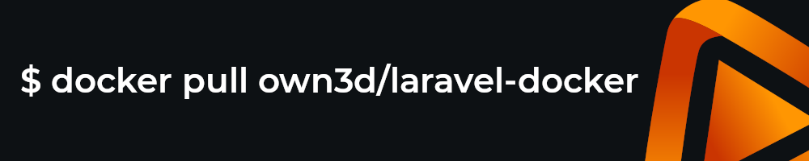

# Laravel Docker



This Docker Image is currently used for our latest projects based on PHP. For security issues please contact support@own3d.tv.

## Images

Here is our official list of images currently under development. Not all images are suitable for production, here are the ones that are maintained:

| Tag                  | Supported | Description                      |
|----------------------|-----------|----------------------------------|
| `8.1-fpm-minimal`    | 👍        | Pre-release                      |
| `8.1-octane-minimal` | 👍        | Ready for Production             |
| `8.0-octane-minimal` | 👍        | Ready for Production             |
| `8.0-octane`         | 👍        | Ready for Production             |
| `8.0-octane-develop` | 🙅‍♀️      | Only for Development             |
| `8.0-fpm`            | 🙅‍♀️      | Only for the migration to octane |
| `8.0-fpm-develop`    | 🙅‍♀️      | Only for Development             |
| `7.4-fpm`            | 👍  ️     | Ready for Production             |
| `7.4-fpm-develop`    | 🙅‍♀️      | Only for Development             |

> All images that are not listed here will be deleted.

## Concepts

### Default Working Directory

For web projects the default working directory is `/var/www/html`. This applies to all `own3d/laravel-docker` images.

## Usage of Octane Minimal

Our new octane-minimal image is our latest image that is ready for production.
Which comes with a decrease of 37.89% in image size (with a total of 572MB instead of 921MB).
It is based on the latest version of PHP 8.1 and has the following php extensions:

```
bcmath curl date gd imagick exif fileinfo hash PDO sockets 
json mbstring pdo_mysql pdo_sqlite sqlite3 zip pcntl redis
swoole posix mongodb
```

The following dockerfile show the usage of the `own3d/laravel-docker:8.1-octane-minimal` image. Per default, it uses the
command `php artisan octane:start --host 0.0.0.0` to start the application and expose the application on port 8000.

```dockerfile
FROM own3d/laravel-docker:8.1-octane-minimal

# copy all your project files to the /var/www/html folder
COPY . /var/www/html
```