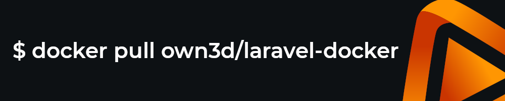

# Laravel Docker



This Docker Image is currently used for our latest projects based on PHP. It is based on the official PHP Docker Image 
and contains all the necessary tools to run Laravel applications. It also contains the necessary extensions to run
most of the popular PHP libraries:
`bcmath`, `curl`, `date`, `exif`, `fileinfo`, `hash`, `imagick`, `json`, `mbstring`, 
`PDO`, `pdo_mysql`, `pdo_sqlite`, `posix`, `redis`, `sockets`, `sqlite3`, `swoole`, 
`zip`, `pcntl`, `gd`, `mongodb`

## Images

Here is our official list of images currently under maintenance. Remember that all `-unstable` and `-develop` 
images are not suitable for production. We use the list of [PHP Supported Versions](https://www.php.net/supported-versions.php)
to determine which images are still maintained and which are not.

| Tag                  | Supported | Description    | Active Support Until |
|----------------------|-----------|----------------|----------------------|
| `8.5-fpm-minimal`    | ✅         | Active support | Nov 2027             |
| `8.5-octane-minimal` | ✅         | Active support | Nov 2027             |
| `8.4-fpm-minimal`    | ✅         | Active support | 31 Dec 2026          |
| `8.4-octane-minimal` | ✅         | Active support | 31 Dec 2026          |
| `8.3-fpm-minimal`    | ❌         | End of life    | 23 Nov 2025          |
| `8.3-octane-minimal` | ❌         | End of life    | 23 Nov 2025          |
| `8.2-fpm-minimal`    | ❌         | End of life    | 8 Dec 2024           |
| `8.2-octane-minimal` | ❌         | End of life    | 8 Dec 2024           |
| `8.1-fpm-minimal`    | ❌         | End of life    | 25 Nov 2023          |
| `8.1-octane-minimal` | ❌         | End of life    | 25 Nov 2023          |
| `8.0-octane-minimal` | ❌         | End of life    | 26 Nov 2022          |
| `8.0-octane`         | ❌         | End of life    | 26 Nov 2022          |
| `8.0-fpm`            | ❌         | End of life    | 26 Nov 2022          |
| `7.4-fpm`            | ❌         | End of life    | 28 Nov 2021          |

> All images that are not listed here will be deleted in the future.
> We reserve the right to delete any end of life images at any time.
> Please keep your infrastructure up to date.

## Concepts

### Default Working Directory

For web projects the default working directory is `/var/www/html`. This applies to all `own3d/laravel-docker` images.

## Usage of Octane Minimal

Our octane-minimal image is ready for production use with Laravel Octane and Swoole.
It is based on the latest version of PHP and has the following php extensions:

```
bcmath curl date gd imagick exif fileinfo hash PDO sockets 
json mbstring pdo_mysql pdo_sqlite sqlite3 zip pcntl redis
swoole posix mongodb
```

The following dockerfile shows the usage of the `own3d/laravel-docker:8.5-octane-minimal` image. Per default, it uses the
command `php artisan octane:start --host 0.0.0.0` to start the application and expose the application on port 8000.

```dockerfile
FROM own3d/laravel-docker:8.5-octane-minimal

# copy all your project files to the /var/www/html folder
COPY . /var/www/html
```

## Usage of PHP-FPM

The following dockerfile shows the usage of the `own3d/laravel-docker:8.5-fpm-minimal` image. Per default, it uses
supervisor to start the application and expose the application on port 8000.

```dockerfile
FROM own3d/laravel-docker:8.5-fpm-minimal

# copy all your project files to the /var/www/html folder
COPY . /var/www/html

# update permissions for all project files
RUN chown -R www-data:www-data /var/www/html
RUN chmod -R ug+rwx storage bootstrap/cache
```

## Development

### CI

We use GitHub Actions to build and test our images. All four active images (`8.4` and `8.5`, both `fpm-minimal` and
`octane-minimal`) are built on every push.

We only create "main" images on the master branch, `-develop` images on the develop branch,
and `-unstable` images on all other branches — avoid concurrent builds on separate branches.

### Build

The best way to test out a new image is to build it locally. You can do this by running the following command:

> This will build the image with the name `own3d/laravel-docker:<name>-develop`.
> Do not push those images to the registry, they are only for testing purposes.

```bash
./bin/build-develop.sh 8.5-octane-minimal 8.5-fpm-minimal
```

### Testing

It's a requirement to test the image before pushing it to the registry using the CI/CD pipeline. This ensures that 
the image is working as expected and every extension is installed correctly for the given PHP version.

To test the image locally, you can run the following command:

```bash
./bin/check-platform-reqs.sh 8.5-octane-minimal 8.5-fpm-minimal
```

## Security

For security issues please contact us directly at [support@own3d.tv](mailto:support@own3d.tv).
